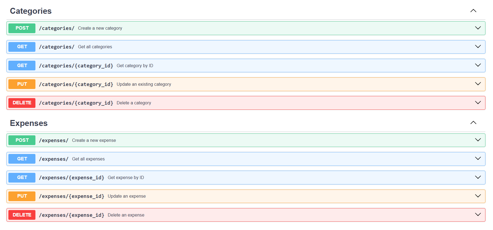

# Expense Tracker API
Expense Tracker API is a RESTful backend application built with FastAPI and SQLAlchemy for managing personal expenses and expense categories.
## Screenshot

## Features
- Category management
- Expense management
- Filtering
- Validation
- Swagger docs
## Tech Stack
- Python
- FastAPI
- SQLAlchemy
- SQLite
- Pydantic
- pytest
## Installation
1. Clone the repository
```bash
git clone https://github.com/kathleen547/fastapi-expense-api.git
cd fastapi-expense-api
```
2. Create virtual environment
```bash
python -m venv venv
venv\Scripts\activate  # Windows
```
3. Install dependencies
```bash
pip install -r requirements.txt
```
4. Run the application
```bash
python -m uvicorn app.main:app --reload
```
5. Open the API documentation in your browser:

`http://127.0.0.1:8000/docs`

## API endpoints
### Categories
- GET /categories/
- GET /categories/{category_id}
- POST /categories/
- PUT /categories/{category_id}
- DELETE /categories/{category_id}
### Expenses
- GET /expenses/
- GET /expenses/{expense_id}
- POST /expenses/
- PUT /expenses/{expense_id}
- DELETE /expenses/{expense_id}

## Example requests
### Create Category

POST /categories/

{
  "name": "Food",
  "description": "Groceries and restaurants"
}

### Create Expense

POST /expenses/

{
  "title": "Pizza delivery",
  "amount": 34.99,
  "date": "2026-05-18",
  "category_id": 1,
  "notes": "Dinner with friends"
}

## Testing

The project includes both manual and automated API testing.

### Manual API Testing
- API endpoints were tested using Postman and FastAPI Swagger UI.
- A Postman collection covering CRUD operations for both Categories and Expenses is included in the repository.

### Automated API Testing
- Automated API tests were implemented using pytest and FastAPI TestClient.
- The test suite verifies CRUD operations, validation logic, and error handling for both Categories and Expenses endpoints.
- All tests run against an isolated SQLite test database, ensuring reliable and independent execution.


## Future improvements
- Authentication
- Docker

## What I learned
- how to build REST API with FastAPI
- how to structure a backend application
- how to use SQLAlchemy relationships
- how to validate request data with Pydantic
- how to implement CRUD operations
- how to work with dependency injection in FastAPI
- how to document APIs with Swagger/OpenAPI
- how to implement automated API tests with pytest and FastAPI TestClient.
- how to perform manual API testing using Postman and Swagger UI.